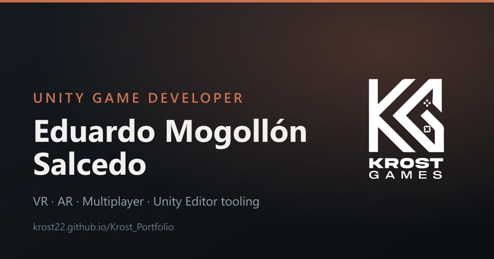

# Krost Portfolio

Portfolio of **Eduardo Mogollón Salcedo** — Unity Game Developer.
VR and AR for standalone headsets, multiplayer, Android games, and custom Unity
Editor tooling.

**Live:** https://krost22.github.io/Krost_Portfolio/



## What it is

A single page with no build step. Projects sit on a 3D shelf you can drag, flip
and filter, rendered with Three.js. Everything else — layout, i18n, audio, the
minigame — is plain ES modules.

- **8 projects** across VR, AR, multiplayer, 360° video, Unity Editor tools and
  published WebGL games, each with year, role, platform, client and highlights.
- **Bilingual** (EN/ES), resolved from your browser language and remembered.
- **Card art composed at runtime**: designed key art is shown whole, screenshots
  get a typographic plate, projects without art get a typographic cover.
- **A minigame**, because it's a game developer's portfolio.
- **Accessible**: skip link, keyboard-driven tablist and carousel, live region
  for shelf changes, focus-visible styling, full reduced-motion path.

## Stack

Vanilla HTML/CSS/JS. Three.js 0.160.0 and GSAP 3.12.5 come from a CDN through an
importmap — there is no bundler, no `package.json` and no dependency install.

## Running locally

```bash
python -m http.server 8000
```

Then open http://localhost:8000.

## Media

Source screenshots live in `Media/<Project>/` next to `.webp` derivatives and a
`cover.webp` (720×1080) used as the 3D card face. **The site loads only the
`.webp` files** — about 2.3 MB in place of ~29 MB of source PNG/JPG. Videos are
`preload="none"` behind a poster frame, so the large captures are fetched only
when someone presses play.

Derivatives are produced with [`sharp`](https://sharp.pixelplumbing.com/);
regenerate them when you add source art.

## Docs

- `PROJECT_CONTEXT.MD` — architecture in detail
- `AGENTS.md` — design rules and the gotchas worth knowing before editing

## Elsewhere

[GitHub](https://github.com/Krost22) ·
[LinkedIn](https://www.linkedin.com/in/eduardomogollonsalcedo/) ·
[Itch.io](https://krostgames.itch.io/) ·
[Sketchfab](https://sketchfab.com/Krost22)
